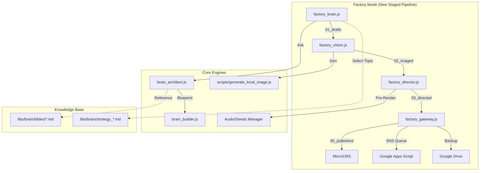

# Content Factory: External Code Review & Audit Report

本ドキュメントは、コンテンツ生成・配信システム「Content Factory」の外部コードレビュー用に作成された技術仕様書です。

## 1. 全体構成 / Total Architecture

### アーキテクチャ図

### 各モジュールの役割一覧

| ファイル名                   | 役割                                                 | 備考                   |
| :--------------------------- | :--------------------------------------------------- | :--------------------- |
| `factory_brain.js`           | 処理の起点。トピック選定、構成、執筆の実行。         | 出力: `01_drafts/`     |
| `factory_vision.js`          | アイキャッチ・挿入画像の生成。                       | 出力: `02_imaged/`     |
| `factory_director.js`        | 動画アセット（音声、スクリプト、シーン画像）の準備。 | 出力: `03_directed/`   |
| `factory_gateway.js`         | MicroCMSへの入稿、SNS投稿予約、Driveバックアップ。   | 出力: `05_published/`  |
| `brain_architect.js`         | 記事の「設計図（Blueprint）」を作成。                | Gemini/Claude使用      |
| `brain_builder.js`           | 設計図に基づき、5,000文字超のHTML記事を執筆。        | Gemini/Claude使用      |
| `scripts/import_articles.js` | MicroCMS APIへのデータ送信。                         | カテゴリ・サイトID制御 |
| `scripts/sync_to_gas.js`     | SNSポスト案をGoogle Spreadsheet（GAS経由）へ同期。   | X自動投稿用            |

### 依存関係

- **処理フローの起点**: `scripts/factory_brain.js`
- **外部エンジン依存**: `brain_architect.js`, `brain_builder.js`, `scripts/generate_local_image.js`
- **データ依存**: `libs/brain/bibles/` (ブランド定義), `src/dna.config.*.json` (デザイン/カテゴリ定義)

---

## 2. コード一式 / Code Inventory

### 主要ディレクトリ構造

- `/scripts/`: システムの全ロジック（`factory_*.js`, `brain_*.js` 等）
- `/libs/brain/`: ブランドバイブル、コンテンツ戦略ファイル
- `/content/`: ステージングフォルダ（`01_drafts` 〜 `05_published`）
- `/video-generator/`: Remotionプロジェクト（React/TypeScript）

### 設定ファイル

- `.env.local`: APIキー（GOOGLE, ANTHROPIC, MICROCMS, GAS_URL等）
- `/src/dna.config.[brand].json`: ブランド別のアイデンティティ、カテゴリ定義。
- `package.json`: 依存パッケージ（Next.js 16.1.3, Tailwind v4, marked, sharp等）

---

## 3. エラー情報 / Known Issues & Errors

現在、以下の課題が特定されており、Factoryモデルの導入によって順次解消を進めています。

| エラー種別         | 現象・メッセージ                               | 該当箇所・原因                           | 対処状況                                            |
| :----------------- | :--------------------------------------------- | :--------------------------------------- | :-------------------------------------------------- |
| **API Rate Limit** | `429 Too Many Requests`                        | Imagen / Gemini APIの連続呼び出し。      | `factory_vision` に30秒スリープ・リトライを実装済。 |
| **Build Failure**  | `Cannot apply unknown utility class not-prose` | Tailwind CSS v4のPostCSSビルドエラー。   | `styles.css` を修正し解消。                         |
| **CI/CD Path**     | `No such file or directory`                    | GitHub Actions上での旧スクリプト実行時。 | 新Farmモデルへの移行により順次廃止・修正中。        |
| **Path Mismatch**  | 動画アセットが特定のフォルダに見当たらない。   | `factory_director.js` のコピー処理不備。 | 修正済（アセットを `video/` フォルダへ集約）。      |

---

## 4. 処理フローの詳細 / Detailed Processing Flow

### 1. バイブル参照 → コンテンツ案決定

`factory_brain.js` が `libs/brain/strategy_[brand].md` から未発表のトピックをランダム抽出。`libs/brain/bibles/` を参照してブランドの思想を注入。

### 2. 構成作成（ブループリント）

`brain_architect.js` が、ターゲットキーワードとブランドDNAを基に、SEO構造・見出し・画像挿入ポイント・SNSポスト案を含むJSON設計図を作成。

### 3. 本文生成（5,000文字）

`brain_builder.js` が、設計図の各セクションを詳細に執筆。「プロの眼」「比較表」などの高度なHTML構造を生成。

### 4. サムネ・挿入画像生成

`factory_vision.js` が `generate_local_image.js` を呼び出し。Google Imagen APIを用いて16:9のWebP画像を3枚生成（アイキャッチ1、本文挿入2）。

### 5. 動画構成生成

`brain_architect.js` (videoモード) が、記事を動画スクリプト（Hook, Problem, Solution, CTA）に変換し、`video-script.json` を出力。

### 6. 手動生成用プロンプト作成（シーン画像）

`scripts/generate-video-seeds.ts` が動画の各シーンに合わせた画像生成プロンプトを自動生成し、ベース画像を出力。

### 7. Remotion自動編集

`video-generator/` 内でアセットが集約される。

- **実行コマンド**: `npm run clip:render`
- `audio.mp3` と `video-script.json` をベースに動画ファイルを合成。

### 8. Driveへの格納 & CMS反映

`factory_gateway.js` が完了プロジェクトを全てGoogle Driveへ同期し、記事データをMicroCMSへ送信。最後にSNS予約（GAS）を実行。

---

## 5. 環境情報 / System Environment

- **実行環境**: Node.js v20.x, MacOS (Local), Ubuntu (GitHub Actions)
- **主要ライブラリ**:
  - `next`: 16.1.3 (App Router)
  - `tailwindcss`: v4
  - `sharp`: 画像処理・WebP変換
  - `microcms-js-sdk`: CMS連携
- **使用API一覧**:
  - **Google Generative AI**: Gemini 2.0 Flash (構成・執筆)、Imagen (画像)
  - **Anthropic**: Claude 3.5 Sonnet / 4.5 Opus (高品質執筆)
  - **Google Drive API**: アセットのバックアップ・共有
  - **X API (via GAS)**: X（Twitter）への自動投稿・スケジューリング
- **連携方法**: `.env.local` 経由のAPI Key認証。各Factoryがステージング用フォルダ（`/content/`）を物理的なステータス管理として利用。
